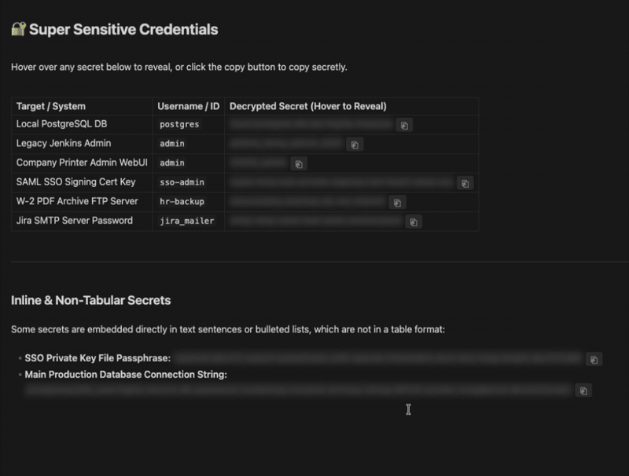

# Secret Copy

Keep passwords, API keys and tokens in your notes without showing them on screen. Wrap a value in `{{double curly braces}}` and Secret Copy blurs it and puts a copy button next to it. Hover to peek, click `⎘` to copy, and the value never has to be visible.

Useful when you share your screen, present, or work where people can see your monitor.



## Features

- **Blurred by default:** every `{{secret}}` is blurred until you hover over it.
- **One-click copy:** the `⎘` button copies the value and shows a short "✓ Copied" confirmation.
- **Exact values:** copies the value exactly as written, even if it contains `*`, `_`, `|` or spaces.
- **Works everywhere:** reading view, Live Preview, source mode and tables.
- **Plays well with highlights:** normal `==highlights==` are left alone, and `=={{secret}}==` gives you a highlighted secret.

## Usage

Wrap any value in double curly braces:

```markdown
Wi-Fi password: {{correct horse battery staple}}

| Service | Token            |
|---------|------------------|
| GitHub  | {{ghp_abc123}}   |
| OpenAI  | {{sk-proj-xyz}}  |
```

**Rules**

- A secret must fit on one line and cannot contain `}}`.
- `{{…}}` inside inline code or code blocks is left as plain text, so you can still write about the syntax.
- `{{date}}`, `{{time}}` and `{{title}}` are placeholders of Obsidian's core Templates plugin and are not treated as secrets.

## Security note

Secret Copy hides values **visually**. It does not encrypt them. Your secrets are still stored as plain text in the `.md` file, so anyone or anything with access to your vault files can read them: sync services, backups, other plugins and Obsidian's search.

Use it to stop people reading over your shoulder or on a shared screen. For real protection at rest, keep sensitive credentials in a password manager or an encrypted vault.

## Installation

### From Community plugins

1. Open **Settings → Community plugins → Browse**.
2. Search for **Secret Copy**, then install and enable it.

### With BRAT

1. Install the [BRAT plugin](https://github.com/TfTHacker/obsidian42-brat).
2. In BRAT's settings, click **Add Beta Plugin**.
3. Enter `https://github.com/LordHeImchen/obsidian-secret-copy`.
4. Enable **Secret Copy** in **Settings → Community plugins**.

### Manually

1. Download `main.js`, `manifest.json` and `styles.css` from the [latest release](https://github.com/LordHeImchen/obsidian-secret-copy/releases).
2. Copy them to `<your-vault>/.obsidian/plugins/secret-copy/`.
3. Reload Obsidian and enable **Secret Copy** in **Settings → Community plugins**.

## Development

There is no build step: `main.js` and `styles.css` are loaded by Obsidian as they are. To try a change, copy both files into your vault's `.obsidian/plugins/secret-copy/` folder and run **Reload app without saving** from the command palette.

## License

[MIT](LICENSE)
